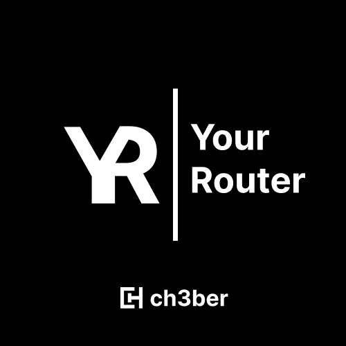

# yourRouter

A powerful router based on client-side routing

## Features

- Support for dynamic routes
- Doesn't reload the page
- Full typescript support

## Documentation

[Documentation repo](https://github.com/ch3ber/yourRouter-docs)

[Documentation website](https://ch3ber.github.io/yourRouter)


## Installation

Install my-project with npm

```bash
  npm i -D yourrouter
```

## Feedback

If you have any feedback, please reach out to us at @ch3ber_dev on twitter


## Authors

- [@ch3ber](https://www.github.com/ch3ber)
